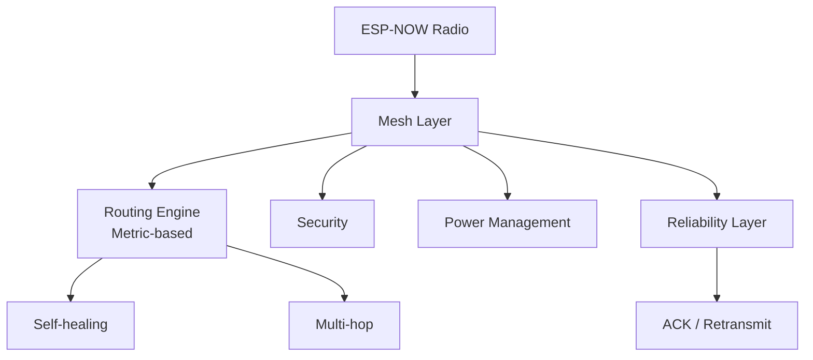

  

    

  <b>ESP-NOW Mesh Network Library v3 — intelligent, metric-based mesh for ESP32</b>

---

## 🛸 Overview

A self-forming, self-healing mesh network library for ESP32 using ESP-NOW. No Wi-Fi infrastructure, no IP stack, no ESP-MESH. Features intelligent routing, security, power management, and reliability.

---

## 🛠️ Features

- Zero Wi-Fi / IP dependency
- Metric-driven route selection
- Automatic topology healing
- AES-encrypted payloads
- Deep sleep support for battery nodes

---

## 🚀 Tech Stack

    

---

  

