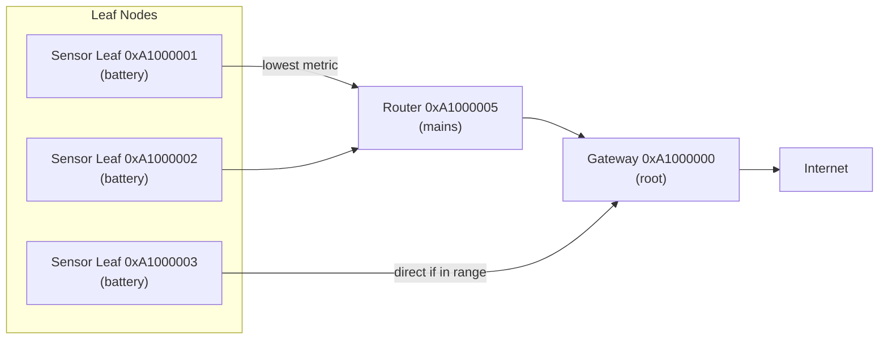
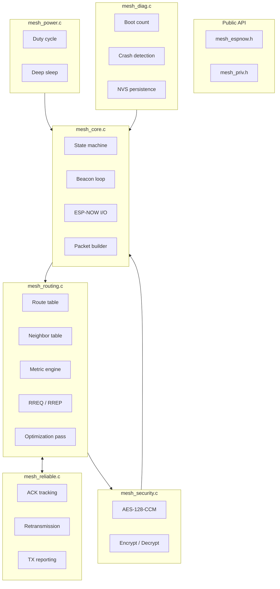

<p align="center">
  
</p>

# 🌐 ESP-NOW Mesh Network Library

**Intelligent, metric-based self-forming/self-healing mesh for ESP32 — no Wi-Fi infrastructure, no IP stack, no ESP-MESH.**

---

<p align="center">
  
  
  
  
  
  
  
  
  
  
  <br>
  
  
  
  
  
</p>

---

# 🛸 What is it?

A lightweight mesh networking library that turns ESP32 boards into a self-healing, multi-hop mesh — using only ESP-NOW. No router, no IP stack, no ESP-MESH complexity.



---

# 🚀 Features

| Feature | What it means |
|---------|--------------|
| **Intelligent routing** | Composite metric: hop count + RSSI + battery + capabilities + reliability |
| **Multi-path** | Primary + backup routes per destination; auto-promoted on failure |
| **Self-healing** | Neighbor lost → backup promoted in <2s; no network flood |
| **Battery-aware** | Prefers mains routers over battery leaves; announced in every beacon |
| **Encrypted** | AES-128-CCM every packet, 8-byte MIC |
| **Reliable** | ACK + exponential-backoff retransmission per hop |
| **1000+ nodes** | Linear scaling with memory; fixed-size tables |
| **Deep sleep** | ~14µA idle — years on a coin cell |
| **Multi-hop** | Up to 32 hops via store-and-forward at each hop |
| **Health monitoring** | Boot count, crash detection via RTC, NVS persistence |
| **No Wi-Fi needed** | ESP-NOW only — no router, no IP, no ESP-MESH dependency |

---

# 🛠️ Quick Start

## ESP-IDF

```bash
git clone https://github.com/btechioi/mesh-espnow.git
cd mesh-espnow/examples/01_sensor_node
idf.py set-target esp32c3
idf.py build flash monitor
```

## Arduino IDE

1. Copy `mesh_espnow/` → `~/Arduino/libraries/`
2. **File → Examples → ESP-NOW Mesh Network Library → 01_sensor_node**
3. Select board, click Upload

```cpp
#include "mesh_espnow.h"

void setup() {
    mesh_espnow_config_t cfg = MESH_ESPNOW_CONFIG_DEFAULT();
    cfg.channel = 6;
    ESP_ERROR_CHECK(mesh_espnow_init(&cfg));
    ESP_ERROR_CHECK(mesh_espnow_start());
}

void loop() {
    mesh_espnow_process(millis());
    delay(100);
}
```

---

# 🛡️ Security

- AES-128-CCM authenticated encryption on every DATA and BROADCAST packet
- 8-byte MIC appended to each ciphertext
- 16-byte pre-shared key — **change the default `"MESH-ESPNOW-MESH"` in production**
- Headers stay in plaintext (needed for forwarding)

| Protected | Not protected |
|-----------|--------------|
| Application payloads | Packet header (src, dest) |
| Broadcast content | Beacon fields (caps, battery) |
| ACK payload | Node existence on network |

---

# 🔋 Power Modes

| Mode | Avg Current | 250mAh Life | 3400mAh Life |
|------|-------------|-------------|-------------|
| `ALWAYS_ON` | ~15 mA | 17 hours | 9 days |
| `DUTY_CYCLE` | ~130 µA | 80 days | 3 years |
| `DEEP_SLEEP` (30s) | ~26 µA | 400 days | 15 years |
| `DEEP_SLEEP` (60s) | ~14 µA | 2 years | 28 years |
| `ON_DEMAND` | ~5 µA | 5.7 years | 78 years |

---

# 📖 Documentation

| Doc | What it covers |
|-----|---------------|
| [Getting Started](https://github.com/btechioi/mesh-espnow/wiki/Getting-Started) | Setup, flashing, first mesh |
| [API Reference](https://github.com/btechioi/mesh-espnow/wiki/API-Reference) | Every function, type, config field |
| [Architecture](https://github.com/btechioi/mesh-espnow/wiki/Architecture) | State machine, packet flow, internals |
| [Protocol](https://github.com/btechioi/mesh-espnow/wiki/Protocol) | On-wire format, packet types |
| [Deployment](https://github.com/btechioi/mesh-espnow/wiki/Deployment) | Production planning, scaling, troubleshooting |

---

# 🏗️ Internal Architecture



---

# 🚀 Tech Stack

<p align="left">
  
  
  
  
  
  
  
  
  
  
  
  
</p>

---

# 📫 Reach Out

- 🐛 **Issues**: [github.com/btechioi/mesh-espnow/issues](https://github.com/btechioi/mesh-espnow/issues)
- 📦 **Releases**: [github.com/btechioi/mesh-espnow/releases](https://github.com/btechioi/mesh-espnow/releases)

---

<p align="center">
  <i>"No Wi-Fi. No router. No limits."</i>
  <br><br>
  
</p>
