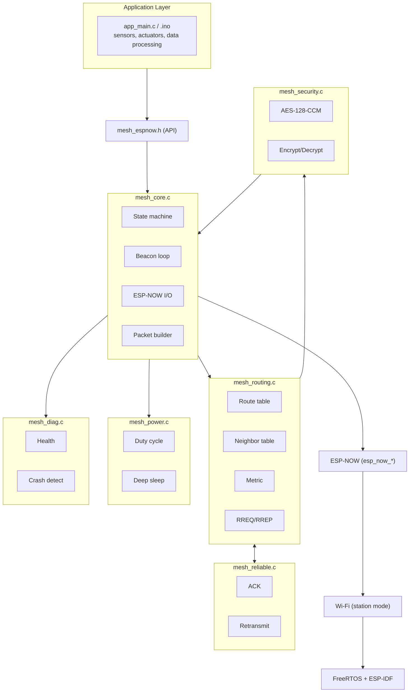
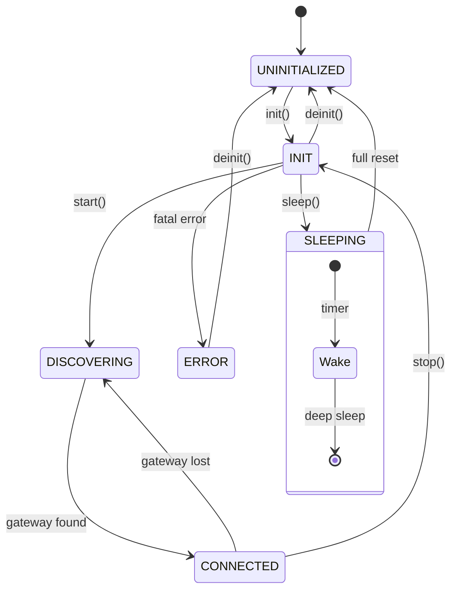
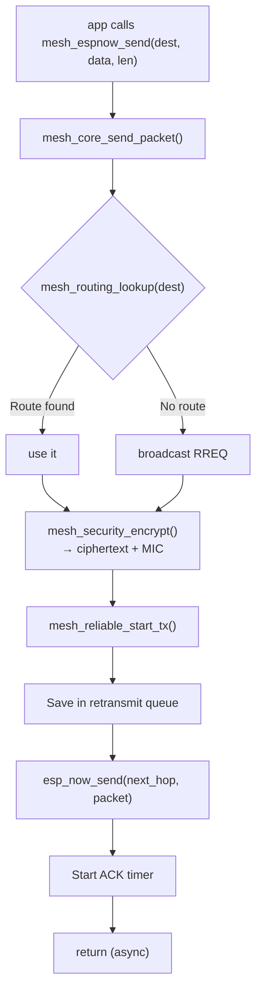
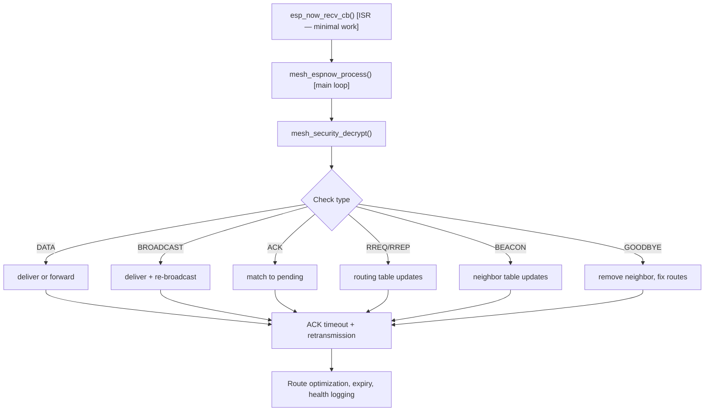

  

# 🏗️ Architecture Guide

> **How the mesh library works under the hood — state machine, packet flow, module interactions.**

---

# 🧬 System Overview

## Arduino Compatibility

All APIs are identical. Just replace:
- `app_main()` → `setup()` / `loop()`
- `vTaskDelay(ms)` → `delay(ms)`
- `esp_timer_get_time() / 1000` → `millis()`

---

# 🧠 Module Responsibilities

## `mesh_core.c` — The Brain

- **State machine** — governs lifecycle
- **ESP-NOW callbacks** — radio send/receive
- **Beacon sender** — periodic "I'm here"
- **Packet builder** — constructs on-wire packets
- **Process loop** — `mesh_espnow_process()` handles all deferred work

## `mesh_routing.c` — The Navigator

- **Neighbor table** — direct radio range nodes
- **Route table** — known destinations (multi-hop)
- **Route metric** — composite: hops, RSSI, battery, capability, reliability
- **Multi-path** — primary + backup per destination
- **RREQ/RREP** — on-demand route discovery
- **Optimization pass** — periodic re-evaluation (every 15s)

## `mesh_reliable.c` — The Courier

- **ACK tracking** — maps ACKs to sent packets
- **Retransmission** — exponential backoff on timeout
- **TX reporting** — success/failure per neighbor for PDR

## `mesh_security.c` — The Guardian

- **AES-128-CCM** — authenticated encryption
- **8-byte MIC** — message integrity code
- **Nonce** — unique per packet (node ID + seq + random)

## `mesh_power.c` — The Battery Saver

- **Duty cycling** — modem-sleep between active windows
- **Deep sleep** — saves state, calls `esp_deep_sleep_start()`
- **Battery reporting** — mV readings to routing layer

## `mesh_diag.c` — The Doctor

- **Boot counting** — NVS persistent counter
- **Crash detection** — RTC memory flag
- **Periodic health logging** — stats every 30s
- **Diagnostic scan** — full table dump

---

# 🔄 State Machine

## Transitions

| Transition | Trigger | What happens |
|-----------|---------|-------------|
| UNINIT → INIT | `init()` | Wi-Fi, ESP-NOW, NVS init |
| INIT → DISCOVERING | `start()` | Beacon timer starts |
| DISCOVERING → CONNECTED | Gateway route found | Via beacon or RREP |
| CONNECTED → DISCOVERING | No gateway routes | Timeout or GOODBYE |
| any → INIT | `stop()` | Goodbye + radio deinit |
| any → ERROR | Fatal error | `on_fatal_error()` fires |
| any → UNINIT | `deinit()` | All memory freed |

---

# 📦 Packet Flow

## Send Path

## Receive Path

---

# 💾 Memory Model

## Static Allocation (no malloc after init)

| Table | Entry size | Default count | Memory |
|-------|-----------|---------------|--------|
| Neighbor table | ~36 bytes | 32 | ~1.2 KB |
| Route table | ~20 bytes | 64 | ~1.3 KB |
| Retransmit queue | ~300 bytes | 16 | ~4.8 KB |
| Duplicate cache | ~24 bytes | 128 | ~3.1 KB |
| **Total** | | | **~10 KB** |

## Eviction Policy

- **Neighbor table**: highest-metric neighbor replaced
- **Route table**: highest-metric route replaced
- **Retransmit queue**: oldest pending dropped

---

# 🧵 Thread Safety

- Single `SemaphoreHandle_t` protects all shared state
- Public API holds mutex; ISR callback defers work
- Mutex **never** held across blocking calls

---

# ⏱️ Timer Architecture (Cooperative)

| Timer | Period | Managed by | Purpose |
|-------|--------|-----------|---------|
| Beacon | `beacon_interval_ms` | `mesh_core.c` | "I'm here" broadcast |
| Route opt | 15s | `mesh_routing.c` | Re-evaluate all routes |
| Neighbor expiry | per process | `mesh_routing.c` | Remove stale neighbors |
| Route expiry | per process | `mesh_routing.c` | Remove stale routes |
| ACK timeout | per packet | `mesh_reliable.c` | Retransmit if no ACK |
| Health log | 30s | `mesh_diag.c` | Periodic stats dump |

---

# 🎯 Key Design Decisions

## Why not ESP-MESH?

| Feature | This library | ESP-MESH |
|---------|-------------|----------|
| Wi-Fi usage | ESP-NOW only | AP + ESP-NOW |
| Max nodes | 1000+ | ~300 |
| Battery support | Deep sleep, duty cycle | Poor |
| Complexity | Simple API | Complex |

## Why fixed-size arrays?

- Predictable memory — no OOM
- No fragmentation
- O(1) indexed lookup
- Configurable via `cfg.max_neighbors` / `cfg.max_routes`

## Why polling instead of tasks?

- Single-core friendly
- App controls timing
- Simpler debugging
- Works with deep sleep (no task to resume)

---

# 🔁 Forwarding (Multi-Hop)

When a node receives DATA not for it:

1. Decrement TTL
2. Look up destination in route table
3. If route exists → re-encrypt + forward to next hop
4. If no route → silently drop

Automatic. Don't set `CAP_LEAF` if you want to forward.

---

# ⚖️ Comparison

| Feature | This library | ESP-MESH | Thread/Matter | LoRa |
|---------|-------------|----------|---------------|------|
| Latency | ~10ms/hop | ~50ms/hop | ~100ms | ~100ms+ |
| Throughput | ~1 Mbps | ~10 Mbps | ~250 Kbps | ~50 Kbps |
| Range indoor | ~50m/hop | ~50m/hop | ~30m | ~1000m |
| Battery life | Years | Days | Months | Years |
| Cost per node | $3-5 | $3-5 | $10-20 | $10-20 |

---

  

